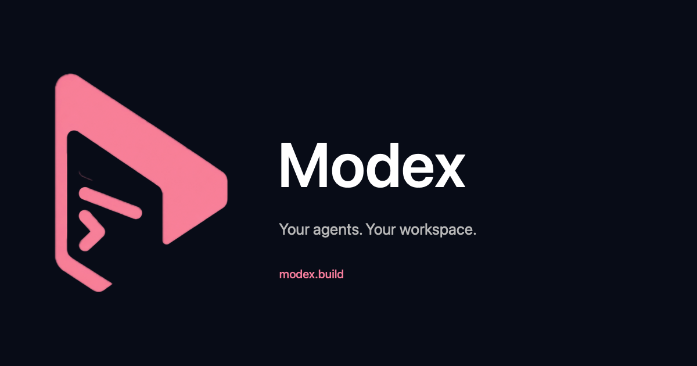
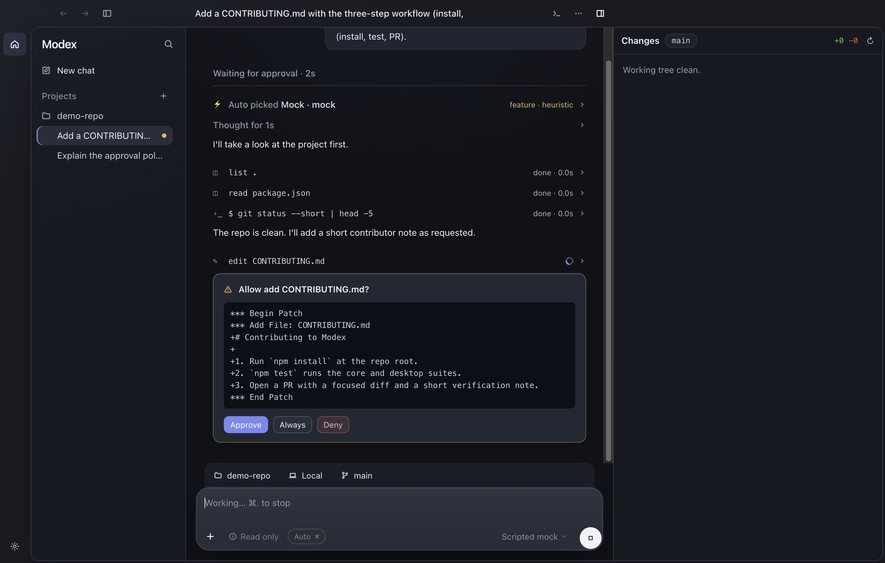
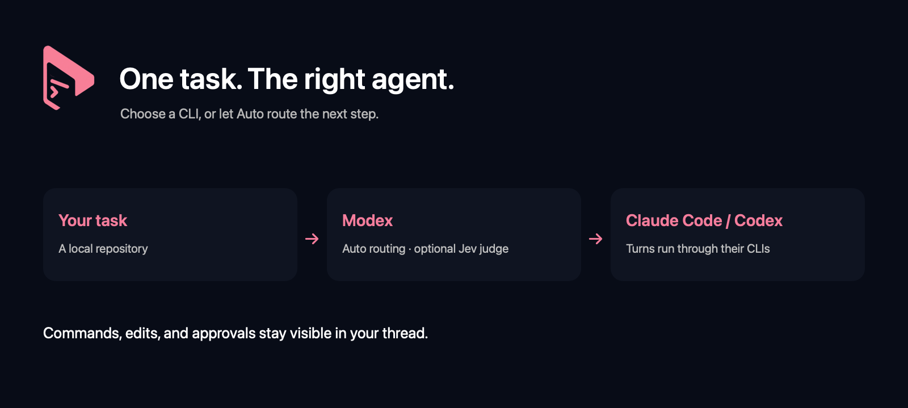

<p align="center">
  
</p>

# Modex

[](https://github.com/TypeSafeAI/modex/actions/workflows/ci.yml)

Modex is an open, Codex-App-style desktop app for running coding agents in your local
repositories. It drives **Claude Code** and **Codex** through their own CLIs (`claude -p`
stream-json and `codex app-server`), using existing CLI logins or app-owned ChatGPT sign-in.
App-owned sign-in is under review; see [its acceptance gates](docs/chatgpt-signin.md).
It never calls a model
API directly. App-owned ChatGPT credentials use protected OS-encrypted storage; existing
Claude and Codex CLI credentials remain with their CLIs.



```
modex/
├── apps/desktop     @modex/desktop  Electron + React app (the Codex-App clone)
└── packages/core    @modex/core     offline scripted engine used by the demo and tests
```

## The desktop app



- **Two backends, one UI.** Every thread picks **Codex** or **Claude** in the composer. Codex
  threads talk to `codex app-server` (the same JSON-RPC protocol the official Codex App uses);
  Claude threads talk to `claude -p --output-format stream-json` with permission prompts routed
  over stdio. The model picker works like the Codex App's: a popover listing exactly the models
  the CLI reports (`model/list` for Codex — every current GPT model with its reasoning-effort
  row; the `fable`/`opus`/`sonnet`/`haiku` latest aliases for Claude), default preselected, no
  free-text entry.
- **⚡ Auto routing.** Turn on Auto and a fast judge — TypeSafe's Jev, or a built-in
  heuristic when no key is configured — reads each request before the turn and picks
  the model, reasoning effort, and fast mode within the bounds you set (posture, effort
  ceiling, daily premium-turn budget, confidence floor). Every turn gets a one-line receipt
  explaining the pick; picking a model by hand teaches Auto your preference for that kind of
  task. The key is pasted into Settings (kept in the OS keychain, never in a build) or
  shared with the [`jev` CLI](https://github.com/TypeSafeAI/cli), which Modex drives
  directly when it is installed. The coding turn itself still runs only through the
  CLIs. See [docs/auto-routing.md](docs/auto-routing.md).
- **Settings you can verify.** Separate sections keep general defaults, coding CLIs,
  Auto routing, and advanced configuration easy to find, with persistent Save and Cancel
  actions. Jev transport, model, and allowed backend controls make routing preferences
  explicit; connection tests identify the saved configuration, and failed saves retain
  your draft. CLI-only routing never falls back to HTTPS, existing sessions stay on their
  backend, and Auto stops if it cannot honor your reasoning-effort ceiling.
- **Launch from anywhere.** Opened from Finder or the Dock, Modex reads your login shell's
  PATH once at startup (interactive `zsh -ilc`, falling back to `-lc`), so `claude`, `codex`,
  and `jev` installed under nvm, Homebrew, or `~/.local/bin` are found exactly as in a terminal.
  Set `MODEX_NO_LOGIN_PATH=1` to skip this.
- **Projects & threads.** Open any local folder as a project. Each project holds threads;
  threads run **in parallel** and independently, each with its own backend, model, and mode.
  Removing a project clears its drafts and thread views while leaving its folder on disk.
- **Worktree threads.** `⑂` starts a thread in a fresh `git worktree` so agents never step on
  each other or on your checkout. If the project ships `scripts/worktree.sh` (as this repo
  does), Modex delegates to it — `new modex-<id>` / `remove` — and the thread lives wherever the
  project's convention says (here: `.worktrees/`). Otherwise it uses a `modex/<id>` branch under
  `~/.modex/worktrees/`.
- **Live transcript.** Assistant replies stream in token by token and render as Markdown;
  tool calls render as collapsible items (`$ command`, `read`, `edit …`) with output and timing.
  Model reasoning — Codex reasoning summaries, Claude extended thinking — streams into a
  collapsible **Thinking** item that folds to "Thought for Ns" when the model moves on. Codex
  threads request `model_reasoning_summary = "detailed"`; Claude Code's CLI reports that the
  model thought but redacts the text, so those rows carry timing only.
- **Inline approvals.** When the mode requires it, the thread pauses on a card showing the
  exact command or patch. *Approve*, *Deny*, or *Always* (trusts that command prefix for
  the thread). *Stop* cancels a running turn and any pending approvals.
- **Changes panel.** Working-tree status for the thread's directory with per-file diffs and
  a one-click revert (confirmed first). Diff failures appear in the panel.
- **Embedded terminal.** Open a shell in the thread's folder with the title-bar terminal
  button or Control + backtick. Hiding the panel keeps its shell running. Close, Restart,
  thread deletion, project removal, and app quit stop its jobs before completing.
- **Unsent text waits for you.** Type into a thread, look at another, come back: the text is
  still there, and the sidebar marks the thread with a pen until it is sent. A new chat always
  starts empty. If a send fails, the message returns to its composer without replacing text
  you typed while the send was pending.
- **Streamer Mode.** Turn it on from the rail before sharing the window. Modex covers the full
  window with an opaque privacy screen, hiding chats, thread and project names, terminals,
  diffs, settings, notifications, and paths while work continues underneath. The cover stays
  on across relaunches and reveals the workspace only when you choose **Show workspace**.
- **Threads name themselves.** A new thread takes its first message as its title right away.
  After that first turn completes, the same CLI is asked, in a separate throwaway chat
  conversation that never touches the transcript, for a short title, and the sidebar updates
  when it answers. Renaming by hand or deleting the thread cancels the request, and a failed
  or slow answer keeps the first-message title.
- **One suggested next step.** When a turn finishes, the composer offers a single follow-up
  (run the checks, review the changes, chase the remaining failure, finish what was asked…).
  Tab, → or a click fills it into the empty box; sending is still your keystroke, and anything
  you type hides it. On Auto threads Jev picks from the fixed list using typed facts about the
  turn (edited files, ran checks, a failed tool, "next steps" in the answer) and never sees
  the transcript; otherwise, or offline, a built-in rule picks. See
  [docs/auto-routing.md](docs/auto-routing.md#the-follow-up-question).
- **Layout that sticks.** The sidebar and Changes panel stay open or closed across relaunches,
  and the window reopens at its last size, position and maximized state (back to the default
  size if its display is gone).
- **Modes**, mirroring Codex, mapped onto each CLI's native policy:

  | Mode | Codex (`approvalPolicy` / sandbox) | Claude (`--permission-mode`) |
  | --- | --- | --- |
  | Chat | `untrusted` / read-only | `manual`, edits disallowed |
  | Agent | `on-request` / workspace-write | `acceptEdits` |
  | Agent (full access) | `never` / danger-full-access | `bypassPermissions` |
  | **Plan** toggle | read-only + plan instructions | `plan` |

- **Shortcuts.** `⌘N` new thread · `⇧⌘N` thread in a worktree · `⌘⏎` (or `⏎`) send ·
  `⇧⌘P` plan · `⌘.` stop · `⌘J` changes panel.

- **Settings.** Default backend and mode, CLI executables with separate installation/version
  and account checks, default model per backend, or the offline mock engine for demos. Model
  catalogues and account status do not prove that a coding turn can access a model.

Each CLI applies its own instruction files (`AGENTS.md`, `CLAUDE.md`), hooks, MCP servers, and
skills exactly as it would in a terminal.



### Run it

For macOS on Apple Silicon, download the DMG or ZIP from the
[latest release](https://github.com/TypeSafeAI/modex/releases/latest). Replace the existing
app to upgrade; projects, threads, and preferences remain in `~/.modex`. Builds from v0.0.5
are signed with a Developer ID and notarized by Apple, so they open without a Gatekeeper
warning; v0.0.1–v0.0.4 were ad-hoc signed and need a right-click → Open the first time. You
still need `claude` or `codex` installed and logged in. To check a download yourself, see
[docs/release-signing.md](docs/release-signing.md).

To run from source, install Node.js 22 or later and the Xcode Command Line Tools on macOS
(`xcode-select --install`). The build compiles a terminal supervisor; the packaged app
doesn't need a compiler.

```sh
npm install
npm run build
npm run desktop          # requires `claude` and/or `codex` on PATH, already logged in
```

Offline demo (no key needed) — seeds a throwaway project and a scripted agent, then
captures screenshots:

```sh
npm run screenshot -w @modex/desktop -- --screenshot=/tmp/modex-shots --demo-answer=yes
```

Development loop: `npm run dev -w @modex/desktop` (Vite on :5178) and
`MODEX_DEV_URL=http://localhost:5178 npm run desktop` in another shell.

## Offline engine (`@modex/core`)

The "mock" backend is a small in-process agent loop with a scripted model. It exists so the UI
can be demoed, screenshotted, and tested without any CLI or account: tools (`shell`,
`read_file`, `list_dir`, `write_file`, Codex-format `apply_patch`), the approval-policy ×
sandbox-mode matrix, a macOS Seatbelt profile, and JSONL sessions.

## Tests

```sh
npm test         # core (patch engine, policy, agent loop) + desktop (backends, runner, git, store)
npm run test:e2e # Playwright drives the real Electron window: ⌘N, type, ⌘⏎, Approve, ⇧⌘P, ⌘J, relaunch
```

The desktop suite drives both CLI backends against scripted fake processes (Claude
`control_request`/`control_response`, Codex JSON-RPC requests, notifications, and approval
server-requests) and the runner end to end with the offline engine: approvals pause and resume
a turn, denial leaves the tree untouched, `Stop` interrupts, two threads run concurrently, and
worktree threads are created and removed. The e2e suite (`apps/desktop/e2e/app.spec.ts`)
launches the packaged app with a seeded `MODEX_HOME` and the offline mock backend, so it needs
no CLI login: it asserts the approval card blocks the edit until *Approve* is clicked, that the
Changes panel shows the resulting diff, and that the thread is restored after a relaunch.

## Working on Modex

Every session works in its own worktree: `scripts/worktree.sh new <name>` creates
`.worktrees/<name>` on a branch of that name from `origin/main`; the primary checkout stays on
`main`. See `AGENTS.md` (also loaded by Claude Code via `CLAUDE.md`) for the full convention.

## Branch protection

`main` is meant to accept only signed commits that passed the CI check. The ruleset lives at
`.github/rulesets/main.json` (import it under *Settings → Rules → Rulesets → Import*, or
`gh api -X POST repos/TypeSafeAI/modex/rulesets --input .github/rulesets/main.json`). GitHub
only enforces rulesets on private repositories for paid org plans; on the Free plan the repo
must be public for the rules to apply.

## Not (yet) here

Codex Cloud tasks, scheduled automations, image attachments, auto-update, and Windows/Linux
installers. Modex has no HTTP-API execution mode;
if a CLI is not installed or logged in, the thread says so.

## License

MIT
