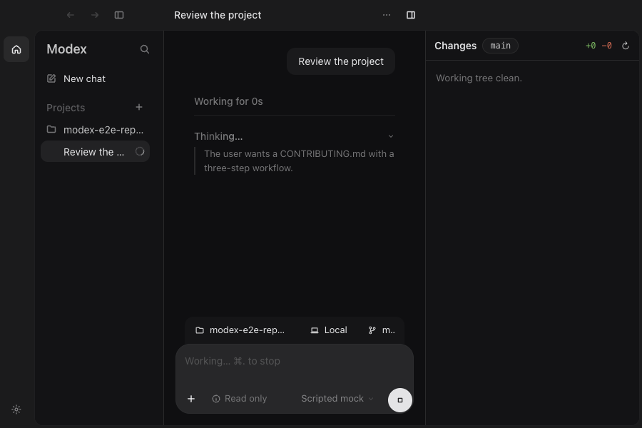

# Desktop v0.0.2 release review

The release scope is reviewed main, starting at `f657a67908aa3707c4cc5a7b1b4806f8751639bd`, plus the fixes below. Desktop v0.0.1 was the previous release. The distribution remains macOS Apple Silicon, ad-hoc signed and not notarized. The monorepo and core package keep their existing versions.

This review extends the [desktop architecture and interaction review](2026-09-28-desktop-review.md). The embedded terminal panel in [PR #32](https://github.com/TypeSafeAI/modex/pull/32) is outside this release.

## Findings resolved

| Reproduced failure | Fix and regression evidence |
| --- | --- |
| Reasoning-effort choices could not receive keyboard focus. | Native menu radio buttons participate in arrow-key navigation; Enter selects effort and restores focus to the picker. Choice menus focus their selection without changing mixed command menus. |
| Choosing a draft model was overwritten by a second state update for effort. | Update model and default effort together. Electron coverage selects a different model after setting effort. |
| Unsent text followed the user into a different project or a new chat. | Give thread and draft composers distinct identities. Tests switch projects and start a second draft; changing settings within the same draft preserves text. |
| The composer overflowed the main pane at the supported 900 × 600 minimum. | Compact sidebar/Changes widths and a shrinkable model picker keep the controls inside the pane. Long project and branch labels truncate without overlapping the execution context. Geometry assertions and a rendered capture cover this size. |
| Disposing Codex left commands owned by its app-server running. | Terminate the owned process group and await close. A real child-process fixture verifies the worker exits. |
| Quitting exited before the CLI stopped and the final transcript was flushed. | Hold application quit until runner disposal and turn finalization finish. A scripted CLI delays termination; Electron verifies acknowledgement and saved output. |
| Auto routing could reopen a disposed backend while shutdown was in progress. | Reject new runner work and model discovery after disposal starts; reject IPC during shutdown, including requests waiting for login-path initialization. A real Router regression verifies no backend resurrection. |
| Model discovery already awaiting a warm Codex server could enqueue a request after disposal and hang quit. | Reject requests before enqueueing when the server or writable stdin is gone. Both direct backend and Router/runner overlap regressions verify rejection and completed shutdown. |
| Diffing a filename containing `*` included unrelated matching files. | Pass literal pathspecs to Git. A temporary repository verifies that only the selected file appears. |

Each behavioral failure was reproduced before its fix. An independent review found no remaining blockers for this scope and separately reran the process-disposal, literal-diff, delayed-finalization, and Auto-shutdown regressions.

## Verification

The release candidate was checked on macOS 26.6.2, Apple Silicon, Node 24.18.1:

- Build and TypeScript checks passed.
- 108 unit tests passed: 15 core and 93 desktop.
- 44 Electron end-to-end tests passed from source and against the packaged application, using isolated homes and temporary repositories.
- An upgrade smoke test created a completed thread with the published v0.0.1 ZIP, then opened the same isolated home in v0.0.2. Projects, threads, settings, and the exact saved transcript were preserved, and the prior conversation rendered.
- The packaged PTY test started a real terminal, verified its working directory and TTY, and observed a successful exit. This checks the ASAR/native-module packaging without exposing a panel in the UI.
- The app reports version 0.0.2 and arm64 architecture. `codesign --verify --deep --strict` passed with an ad-hoc signature; DMG checksum verification and ZIP archive integrity checks passed.

The suite covers draft/send, approval/denial, stop, project/thread navigation, model and effort selection, Settings focus containment, IME input, worktrees, Changes selection/revert, transcript scrolling, streamed persistence, layout restoration, window close/reopen, and application quit. Rendered draft, typing, approval, completed transcript/diff, expanded items, model/effort menu, hidden Changes, and minimum-window states were inspected. Large-window captures use 1786 × 1049; effort navigation uses 1380 × 880; the compact capture uses 900 × 600.



Run the source checks from a worktree:

```sh
npm run build
npm test
npm run typecheck
npm run test:e2e
```

Build and exercise the actual bundle:

```sh
npm run dist -w @modex/desktop
MODEX_PACKAGED_APP="$PWD/apps/desktop/release/mac-arm64/Modex.app/Contents/MacOS/Modex" npm run test:e2e
codesign --verify --deep --strict --verbose=2 apps/desktop/release/mac-arm64/Modex.app
hdiutil verify apps/desktop/release/Modex-0.0.2-arm64.dmg
unzip -tq apps/desktop/release/Modex-0.0.2-arm64.zip
```

Playwright writes captures and failure traces under `apps/desktop/test-results/`; each run replaces that directory. Release downloads include `SHA256SUMS.txt` for artifact verification. The release tag and GitHub PR checks provide the source and hosted-CI receipts.

The launch helper waits for the native window to show before tests resize it. One hosted run exposed a startup race where showing the window restored its initial bounds after the reference-size precondition had passed; the exact screenshot geometry assertions remain in place.

## Deferred work and proof limits

Before shipping the terminal panel, fix and regress terminal descendant cleanup: a foreground command that ignores SIGHUP can survive closing its PTY shell. Cover terminal close, thread/project removal, and app quit with that command. Main's renderer does not call the terminal engine, so this is a prerequisite for PR #32 rather than a blocker for the selected main-only release. The existing external-terminal action remains available.

Offline scripted CLI tests do not establish live-provider execution, paid-model behavior, or human VoiceOver acceptance. Automated keyboard tests establish the interactions described above. This release does not add notarization, a custom app icon, auto-update, or Windows/Linux installers.
