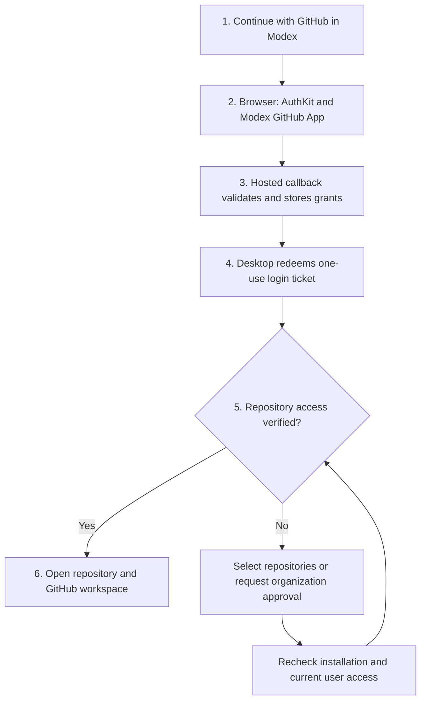

# WorkOS account and native GitHub integration review

> Historical proposal, recovered on 2026-10-11 from commit `c63e7f1`.
> Findings, provider documentation, and staging configuration below describe
> October 7 and have not been revalidated as current deployment state.
> [PR #141](https://github.com/TypeSafeAI/modex/pull/141) subsequently delivered
> [native identity-only sign-in](../modex-signin.md) using public-client PKCE and
> the existing OAuth App. That shipped flow discards GitHub provider tokens;
> it does not implement this proposal's repository authorization or hosted service.
> The dedicated GitHub App owner/identity and hosted service destination remain
> explicit inputs for that broader work. Preserve this design as provenance,
> not as instructions to replace the shipped sign-in architecture.

Use WorkOS AuthKit with a Modex-owned GitHub App for both account sign-in and GitHub authorization. Keep GitHub credentials in a hosted Modex service and expose typed, permission-checked operations to the desktop. Present account creation, repository selection, and opening a project as one resumable flow.

Reviewed 2026-10-07 against `77b026468ae9be9b1deda9b867e94d3886a16687`. This is a source and architecture review, not a deployed integration or live tenant acceptance result. The initial review did not verify account configuration. The staging follow-up below records subsequent live configuration evidence. No production settings were changed.

## Decision and alternatives

| Approach | Benefit | Limitation | Decision |
| --- | --- | --- | --- |
| AuthKit with the same Modex GitHub App for identity and API access | Reuses the sign-in authorization; selected repositories, user attribution, installation webhooks | Requires hosted credential lifecycle, installation reconciliation, and an API service | Recommended for deep GitHub functionality |
| AuthKit plus WorkOS Pipes | Managed connection UI, credential storage, and refresh | Do not assume the AuthKit grant is automatically a Pipes connection, or that Pipes manages installation tokens and events | Evaluate as the credential manager behind the same architecture |
| AuthKit plus a broad GitHub OAuth App or existing host `gh` login | Smaller initial implementation | Broad OAuth repository scopes or dependence on separately configured host identity | Keep explicit CLI fallback; do not make it the primary onboarding path |

WorkOS documents support for GitHub Apps as social providers, including returned provider tokens when enabled. This makes reuse of the login grant feasible. Repository installation remains a separate permission decision; sign-in cannot grant access to arbitrary organization repositories. Configure Email addresses read permission for sign-in. [WorkOS GitHub integration](https://workos.com/docs/integrations/github-oauth)

The AuthKit code exchange can return `oauth_tokens` separately from its own session tokens. Treat these as different credential families with independent expiration and revocation. Missing provider tokens must produce an actionable connection state, not a successful GitHub connection. [AuthKit authentication reference](https://workos.com/docs/reference/authkit/authentication)

Pipes supports managed provider connections, backend token retrieval, and a relay. Its API also supports importing connected accounts. A staging spike must prove importing this exact GitHub App grant, refresh rotation, reconnect behavior, and deletion semantics before choosing Pipes as its sole owner. Never let both Pipes and Modex refresh the same token. [Pipes](https://workos.com/docs/pipes), [connected accounts](https://workos.com/docs/reference/pipes/connected-account)

## Current application findings

| Finding | Evidence | Consequence |
| --- | --- | --- |
| No WorkOS integration in tracked application source or manifests | Repository search for `workos` and `authkit` returned no matches | This is new account infrastructure, not a provider toggle |
| GitHub support reads branch PR metadata through host `gh api` | `apps/desktop/src/main/engine/thread-context.ts` | Native GitHub account state, installation selection, mutations, and event sync need implementation |
| Existing PR reader handles fork/base relationships, coalescing, trusted hosts, and distinct unavailable states | Same file; `apps/desktop/test/thread-context.test.ts` | Preserve these behaviors when replacing its transport |
| App-owned ChatGPT sign-in already has browser callbacks, encrypted storage, identity checks, cancellation, and serialized refresh | `apps/desktop/src/main/engine/chatgpt-auth.ts`; `chatgpt-auth.test.ts` | Reuse design patterns, not OpenAI-specific endpoints, scopes, or registrations |
| Renderer runs sandboxed with context isolation; main process checks sender; bridge types are compile-time | `apps/desktop/src/main/index.ts`, `preload.cjs`, `apps/desktop/src/shared/types.ts` | Add runtime request schemas and narrow GitHub commands; never expose a generic authenticated HTTP proxy |
| Command registration also populates remote desktop commands unless `localOnly` | `handle()` in `apps/desktop/src/main/index.ts` | Keep sign-in, account linking, and credential changes local-only initially; review Companion authorization explicitly |
| Settings connections currently focus on model providers | `apps/desktop/src/renderer/components/SettingsDialog.tsx` | Separate Modex account, GitHub access, and model connections in the UI |
| Website is Vite with a public release-feed function | `apps/site/README.md`, `apps/site/server/github-release.mjs` | There is no existing authenticated control plane to extend blindly |
| Local Git operations have their own implementation | `apps/desktop/src/main/engine/git.ts` | API authorization does not automatically solve clone, fetch, or push credentials |

These are inspected source findings. Existing tests were inspected for coverage, not executed as evidence of a future WorkOS flow.

## End-to-end experience

1. **Continue with GitHub.** Open the system browser, retain the selected project and intended action, and show a cancellable waiting state. Use the same entry point for new and returning accounts. Keep local projects usable without a cloud account.
2. **Authenticate and create the account.** AuthKit handles GitHub sign-in. On first verified completion, idempotently create the Modex profile keyed by WorkOS user ID. Obtain GitHub's stable numeric user ID from authenticated `/user`; use login and email only as display attributes. Do not invent a second password or merge identities by matching email.
3. **Confirm repository access.** Reuse the GitHub App user authorization received at sign-in. Discover installations and accessible repositories. If access is missing, open installation/selection for that same App. Show the acting GitHub identity, personal/org owner, selected repositories, and requested capabilities.
4. **Handle organization approval.** An approval request is pending, not connected. Offer another repository and a resumable status screen. Distinguish SAML reauthorization, insufficient user access, suspended installation, removed repository, and unavailable service.
5. **Open your workspace.** Suggest existing checkouts whose canonical repository ID matches. Otherwise offer clone destination and safe creation of a new checkout. Do not overwrite dirty files or alter existing remotes automatically.
6. **Make GitHub useful immediately.** Show a repository overview, review requests, your PRs/issues, checks, and the current thread's linked PR. Every status includes freshness and a source link.
7. **Return without setup.** Restore the account and repository selection, renew the appropriate session silently, and reconcile permissions. Ask again only when a grant is missing, expired, revoked, or requires consent.

One GitHub identity does not imply one consent screen. GitHub may require both user authorization and installation approval. The product should preserve context across those steps rather than promise that consent disappears.

## Recommended architecture

Add a small TypeScript service, proposed as `apps/api`, with durable relational state, encrypted credential storage, a job queue, and public webhook endpoints. Keep it separate from the public release feed. Hosting selection can follow existing operational ownership; the review does not require migrating the website to Next.js.

Prefer a hosted AuthKit callback for this design because GitHub grants and refresh credentials should stay server-side. Desktop begins a short-lived login transaction with a random state and a SHA-256 challenge. The service binds that transaction to its browser OAuth state and approved desktop return destination. It exchanges the AuthKit code server-side, stores credentials, and returns only a one-use ticket. Desktop redeems the ticket with its original verifier over HTTPS. Tickets expire quickly, are atomically consumed, and never act as bearer login sessions by themselves. This handoff is an application protocol requiring dedicated tests, not a built-in WorkOS endpoint.

Use a loopback listener bound only to `127.0.0.1`, a fixed callback path, and a transaction-bound ephemeral port. Reject arbitrary callback hosts, duplicate parameters, invalid state, replay, and wrong methods. Do not put tokens in callback URLs. Browser completion must say return to Modex until redemption succeeds. An authenticated polling recovery bound to the same verifier can recover interrupted handoff. If adding a custom URL scheme later, treat its handler as untrusted input.

WorkOS also supports public-client PKCE, so direct native AuthKit is a valid alternative if avoiding the handoff is more valuable than keeping provider tokens off-device. It still needs a hosted service for the GitHub App private key and webhooks. Do not put a WorkOS API key or GitHub client secret in Electron or a `VITE_*` variable. [WorkOS public-client support](https://workos.com/changelog/node-sdk-v8-pkce-support-and-improved-runtime-compatibility)

The hosted service should issue revocable per-device Modex sessions linked to the WorkOS session. Keep renewable desktop credentials encrypted in main-process storage, reject insecure Linux `basic_text`, serialize rotation, and clear in-memory access on logout. Validate server session state on requests; process WorkOS revocation events and reconcile missed events. An expired or revoked WorkOS session must not leave an independent unlimited Modex session alive.

Store these relationships explicitly:

- `modex_user(workos_user_id)` and device sessions with expiry/revocation state.
- `github_identity(workos_user_id, github_user_id, host)` with encrypted credential reference and generation/version for rotation.
- `github_installation(app_id, installation_id, github_owner_id, status)` and selected repository IDs.
- Explicit workspace membership and installation bindings. A WorkOS organization is not automatically a GitHub organization; installation ownership is not universal member authorization.
- Operation receipts, webhook delivery records, sync cursors, and cache records scoped by account, installation, and repository.

Interactive writes use GitHub App **user tokens** so GitHub attributes them to the person and applies the intersection of person/App access. Installation tokens serve explicitly authorized background automation; never silently substitute one when a user request is denied. [GitHub user authentication](https://docs.github.com/en/apps/creating-github-apps/authenticating-with-a-github-app/authenticating-with-a-github-app-on-behalf-of-a-user)

Keep the App private key on the server. Installation tokens are short-lived and can be restricted to repositories and permissions when minted. They can authenticate Git-over-HTTPS with Contents permission. [Installation authentication](https://docs.github.com/en/apps/creating-github-apps/authenticating-with-a-github-app/authenticating-as-a-github-app-installation)

Implement one owner for provider refresh, durable compare-and-swap rotation, and recovery after a crash during rotation. GitHub refresh invalidates the previous refresh and access tokens, so concurrent refresh is a correctness issue. [GitHub refresh behavior](https://docs.github.com/en/apps/creating-github-apps/authenticating-with-a-github-app/refreshing-user-access-tokens)

For clone/fetch/push, use an app-scoped credential helper or isolated askpass process with host/repository validation and short-lived credentials. Verify endpoint/token support before selecting user versus installation Git credentials, show the actor, and enforce caller access before vending any installation token. Never persist tokens in remote URLs, command arguments, shared shell environment, or global `gh` configuration. Existing SSH and CLI setups remain an explicit selectable mode with visible identity; never silently mix their authority with the connected Modex identity.

## Native management and useful insights

| Surface | Required behavior | Candidate GitHub App permissions to validate per endpoint |
| --- | --- | --- |
| Repository browser and clone | Search accessible repositories, show org/installation, connect local checkout | Metadata; Contents read |
| Issues | Triage, create, edit, labels, assignees, link issue to thread | Issues read/write |
| Pull requests | Create draft, inspect changes, review/comment, request reviewers, update, merge when allowed | Pull requests read/write; relevant issue endpoints; Contents write for merge |
| CI | Checks, statuses, workflow runs, bounded logs, rerun/cancel | Checks read; Commit statuses read; Actions read/write for controls |
| Git operations | Fetch, branch, commit, push with explicit repository and identity | Contents read/write; Workflows write only for workflow-file changes |
| Releases and projects | Release drafting/publishing, issue planning | Contents write; Projects permissions depend on endpoint and owner |
| Administration | Explain access and link to GitHub settings; add native settings only with endpoint proof | No blanket Administration permission at launch |

This is a candidate matrix, not an assertion that every endpoint supports every token. Record actual endpoints, required permissions, actor type, and acceptance tests before enabling each capability. Prefer REST. Where REST cannot implement a feature, expose a truthful GitHub deep link or explicitly decide on an additional transport; do not imply complete native support.

GitHub App permissions are declared on the App, unlike per-login OAuth scopes. UI feature toggles cannot magically obtain narrower consent. Start with the agreed read/review capability set; permission expansion can require installation-owner approval. Consider a separate optional automation App only if customers require a hard separation of write authority.

Insights should answer concrete questions: what needs my review, which check blocks this PR, what changed since my last visit, which issue has no linked work, and what the next allowed action is. Compute deterministic facts first. Show repository, head SHA, source links, observation time, and missing evidence. AI summaries are optional and run through the existing Claude/Codex CLI architecture with deliberately selected context. Repository text and CI logs are untrusted data, never authorization instructions.

A merge flow refreshes head SHA, permissions, checks, reviews, and GitHub eligibility, then sends the expected SHA. Handle branch rules and merge queues as authoritative. Green checks alone cannot imply merge permission. Re-read after mutations and surface uncertain outcomes without blindly retrying comments or publication. [Pull request API](https://docs.github.com/en/rest/pulls/pulls)

## Synchronization, privacy, and recovery

Verify webhook signatures against raw bytes, durably enqueue before acknowledging, deduplicate delivery IDs, and handle retries and out-of-order events. Subscribe only to required installation/repository, PR/review, issue, check/status, and workflow events. Reconcile after missed events and on foreground access. Rate-limit and paginate upstream calls; use ETags where supported, coalescing, bounded payloads, and backoff. [GitHub webhook guidance](https://docs.github.com/en/webhooks/using-webhooks/best-practices-for-using-webhooks)

Publish changes to desktop through an authenticated event stream with reconnect cursors. Scope every query, event, and cache key to verified access. Membership removal and repository removal invalidate access and purge disallowed cached records. Never serve installation-wide private data merely because a person belongs to the same WorkOS organization.

Separate sign out of this device, disconnect personal GitHub authorization, uninstall from an organization, and delete the Modex account. Personal logout must not uninstall a shared organization App. Disconnect immediately blocks new actions, invalidates sessions/caches as applicable, and reports remote revocation failures. Account deletion removes owned credentials/data and handles shared installation ownership explicitly.

Keep repository contents local by default. Hosted metadata, review bodies, and CI logs can still contain private information: minimize retention, exclude them from analytics, and document what crosses the service boundary. Redact credentials before telemetry or renderer delivery. Streamer Mode masks displayed values only; it must not alter IDs or credentials used for execution.

## Implementation sequence and proof gates

1. **Tenant/App spike.** Verify the selected WorkOS environment, branded AuthKit domain, provider credentials, redirect URLs, token-return setting, GitHub App ownership, email permission, expiry, installation setup URL, and webhook endpoint. Prove sign-up, repeat sign-in, stable identity, provider tokens, refresh, and selected-repository installation in staging. Compare direct custody with Pipes import using that same grant. Choose one owner based on evidence.
2. **Account foundation.** Add hosted sessions and desktop handoff, encrypted device state, account UI, logout/deletion, and runtime-validated IPC. Keep provider sign-in separate and local projects functional offline.
3. **GitHub read vertical slice.** Replace `ThreadContextReader` network transport behind an interface, retain fork mapping tests, add installation/repository browser, clone flow, PR/check details, event sync, and visible stale/error states.
4. **Native write workflows.** Implement issue/PR/review and Git credential paths with actor previews, permissions, idempotency receipts, expected-head checks, and real GitHub result links. Add Actions/release/project capabilities against their own contracts.
5. **Insights and launch acceptance.** Complete cross-device/account isolation, recovery, performance/accessibility checks, operations runbooks, retention policy, and packaged macOS acceptance. Update `docs/status.md` when implementation actually enters delivery.

Required automated coverage: first/returning login, cancellation, callback replay, wrong state/verifier, expired ticket, concurrent attempts, keychain unavailable, restart/refresh, account switching, identity mismatch, missing email/provider token, organization approval, SAML, installation suspension/removal, revoked grants, workspace isolation, webhook forgery/replay/order, stale head, insufficient permission, rate limits, partial pagination, interrupted writes, offline mode, and no secrets in IPC/logs/renderer/URLs.

Required live staging proof: a fresh GitHub identity creates one WorkOS account; returning sign-in reuses it; a selected private repository opens without prior `gh auth login`; clone/fetch/push use the displayed identity; PR creation, comment/review, CI inspection, and an allowed merge show the correct GitHub actor; an org member without permission cannot act through an installation token; removal/revocation stops access; restart and reconnect recover. Exercise personal and organization installations, two accounts, and an admin-pending flow. Use a disposable repository for mutations.

Run repository gates before pushing implementation: `npm run build && npm test`, plus `npm run test:e2e` for UI. Add service integration tests and packaged-app OAuth acceptance because existing offline browser tests cannot prove provider configuration. Record human keyboard and VoiceOver acceptance separately from automated accessibility checks.

Proposed product targets: interactive account UI without network blocking, cached views within 300 ms, fresh small-repository overview within 2 s under defined test conditions, visible webhook updates within 5 s of receipt, and explicit recovery within one action where authorization permits. Measure provider time separately; these targets are not measured results.

## Remaining account-specific evidence

The architecture recommendation is supported by current source and official documentation. Account-specific feasibility still needs the WorkOS workspace/environment and GitHub App identity, hosted service ownership/domain, and live staging consent/refresh evidence. Supply public names/IDs through the normal configuration workflow; keep secrets in the deployment secret store. This review does not claim those checks have passed or that the integration is implemented.

## Staging bootstrap follow-up (2026-10-07)

Live WorkOS control-plane reads confirmed that the supplied GitHub OAuth client `Ov23lix9yLBVFiQh0Vqa` is already configured in TypeSafe production, with provider-token return disabled. Its applications include TypeSafe Place and River Oaks callback URLs. Reusing or changing this shared provider could affect those applications; it was left intact.

Created a separate Modex project with only a sandbox staging environment and renamed its default application to Modex, with homepage `https://modex.codes`:

| Resource | Public ID |
| --- | --- |
| Project | `project_01M4B32MNNKP9H7HAG2V4QBE59` |
| Staging environment | `environment_01M4B32MP93EV7ZXYWP85KEVA7` |
| AuthKit application | `app_01M4B32N4PYTFYQ9VPHZ4NH7RX` |
| WorkOS client | `client_01M4B32N0CQBCPPMZ5WA4NM5P4` |

Creation and application settings were verified by subsequent control-plane reads. No production Modex environment was created. No GitHub provider credentials, redirect URLs, or hosted auth service have been configured for this new environment.

The next required inputs are the dedicated GitHub App owner/identity and the deployment destination for the Modex auth service. Configure a GitHub App (not the existing River Oaks OAuth App), using the exact callback supplied by this new environment's WorkOS GitHub integration. Configure Email addresses read access, expiring user tokens, and provider-token return; additional repository permissions must follow the capability contracts above. Place its secret and private key in the chosen service's secret store, never desktop config or source control.

Implementation and live consent, token refresh, installation, and account-isolation acceptance remain pending. The staging bootstrap is not evidence of a working desktop sign-in flow.
